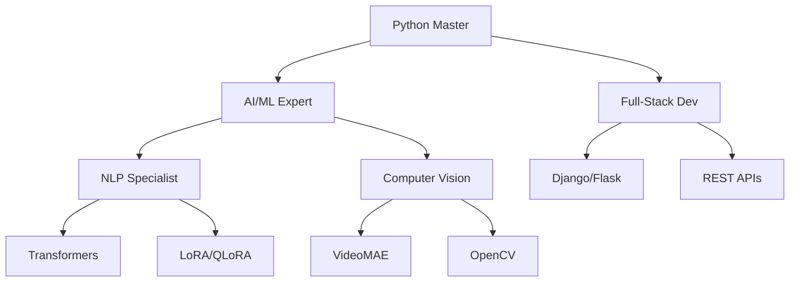

# 🎮 Ritika Kalia's Dashboard

[](https://github.com/Ritikakalia1)
[](https://www.linkedin.com/in/ritika-kalia-809984330/)


---

## 🎯 Level: AI/ML Engineer & Full-Stack Developer

```python
class RitikaKalia:
    def __init__(self):
        self.current_level = "Final Year CSE"
        self.cgpa = 9.32
        self.experience = "Research & Development"
        self.skills = ["AI/ML", "Full-Stack", "NLP", "Computer Vision"]
        self.achievements = ["IEEE ICIR 2026", "ACM-W Chairperson"]
    
    def status(self):
        return "🚀 Building intelligent systems & leading tech communities"
```


---

## 📊 Live GitHub Analytics

<div align="center">
  
  
</div>

---

## 🔥 Contribution Streak & Stats

<div align="center">
  
</div>

---

## 🎮 Arcade Contribution Graphs

<div align="center">

### ⭐ PAC-MAN EDITION ⭐
*Collect all dots = Your commits!*

<!-- pacman -->
<picture>
  <source media="(prefers-color-scheme: dark)" srcset="https://raw.githubusercontent.com/Ritikakalia1/Ritikakalia1/output/pacman-contribution-graph-dark.svg">
  <source media="(prefers-color-scheme: light)" srcset="https://raw.githubusercontent.com/Ritikakalia1/Ritikakalia1/output/pacman-contribution-graph.svg">
  
</picture>

---

### 🧱 BREAKOUT EDITION 🧱
*Break bricks = Break records!*

<!-- breakout -->
<picture>
  <source media="(prefers-color-scheme: dark)" srcset="https://raw.githubusercontent.com/Ritikakalia1/Ritikakalia1/output/breakout-contribution-graph-dark.svg">
  <source media="(prefers-color-scheme: light)" srcset="https://raw.githubusercontent.com/Ritikakalia1/Ritikakalia1/output/breakout-contribution-graph.svg">
  
</picture>

---

### 🐍 SNAKE EDITION 🐍
*Watch the snake eat your contributions!*


</div>

---

## 🚀 Featured Quests (Projects)

<div align="center">

| Projects | 
|-------|------------|--------|----|
| 🧠 **Multilingual Legal QA** |
| 🎥 **Video Violence Detection** |
| 🛒 **E-Commerce Platform** | 
| 🧬 **Brain Tumor Detection** |
| 🕶️ **XR Privacy Research** | 

</div>

---

## 🏅 Skill Tree

<div align="center">



</div>

---

## 🎮 Gaming Stats

<div align="center">

| Platform | Status |
|----------|--------|
| 🎮 **LeetCode** |  |
| 🐍 **Python** |  |
| ⚡ **FastAPI** |  |
| 🧠 **AI/ML** |  |

</div>

---

## 📚 Research Dungeon

<div align="center">

| Publication | Venue | Boss Defeated |
|-------------|-------|---------------|
| **XR Privacy Guardianship** | IEEE ICIR 2026 | ✅ Dragon Slain |
| **Memory in Conversational AI** | Insights2TechInfo | ✅ Manuscript Published |

</div>

---

## 👥 Guild Leadership

<div align="center">

| Role | Guild | Members | Quest Completed |
|------|-------|---------|-----------------|
| **Chairperson** | ACM-W CCET | 15+ | 🏰 10+ Workshops |
| **Tech Team** | CCET APRIMAT 2025 | - | ⚔️ 5 Competitions |
| **Web Designer** | CCET Official | - | 🎨 10+ Pages |

</div>

---

## 📈 Weekly Activity Heatmap

<div align="center">
  
</div>

---

## ⚔️ Language Battle Royale

<div align="center">
  
  
</div>

---

## 🏆 Trophy Collection

<div align="center">
  
</div>

---

## 🎯 Current Side Quests

- 🔭 Building production AI systems
- 🌱 Fine-tuning LLMs for Indian languages
- 👯 Open for collaborations
- 💬 Ask about: PyTorch, Transformers
- 🎮 Secret level: I presented at IEEE ICIR 2026!

---

## 📊 Real-Time Server Status

<div align="center">

| Service | Status | Uptime |
|---------|--------|--------|
| 🤖 AI Models | 🟢 Online | 99.9% |
| 🌐 APIs | 🟢 Online | 99.9% |
| 📊 Analytics | 🟢 Online | 99.9% |
| 🎮 Game Server | 🟢 Online | 99.9% |

</div>

---

## 🔗 Connect with Me

[](https://github.com/Ritikakalia1)
[](https://linkedin.com/in/ritika-kalia)
[](https://ritikakalia.dev)
[](mailto:ritika@example.com)

---

<div align="center">

**💀 Total Repositories:** 21 | **🚀 Private Repos:** 21 | **⚡ Public Repos:** 0

[](https://github.com/Ritikakalia1)
[](https://github.com/Ritikakalia1)

---

*⚡ Powered by Python, PyTorch & Coffee ⚡*  
*🎮 Game Over? No, Game On! 🎮*

</div>

---

## 🛠️ How to Set This Up

### Step 1: Add Snake Game
Add this to `.github/workflows/main.yml`:

```yaml
- uses: Platane/snk@v3
  with:
    github_user_name: ${{ github.repository_owner }}
    outputs: |
      dist/github-contribution-grid-snake.svg
      dist/github-contribution-grid-snake-dark.svg?palette=github-dark
```

### Step 2: Add Trophy Card
```markdown
[](https://github.com/Ritikakalia1)
```

### Step 3: Add LeetCode Stats
```markdown
[](https://leetcode.com/Ritikakalia1)
```

### Step 4: Customize Colors
Change `theme=radical` to:
- `dark` - Professional dark
- `github_dark` - GitHub native
- `blue-green` - Cool tones
- `omni` - Colorful
- `onedark` - VS Code theme

---
