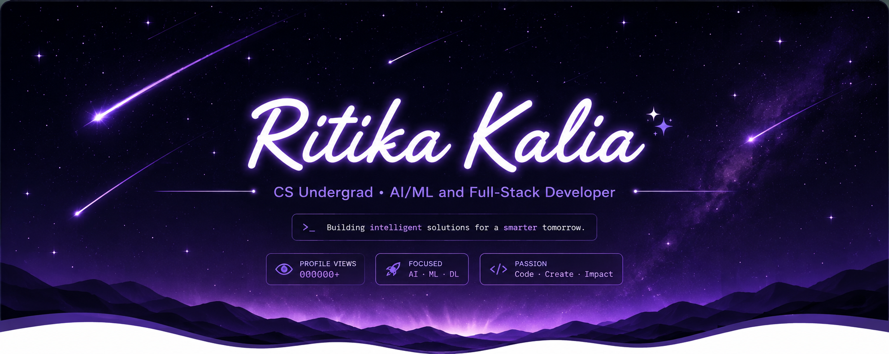
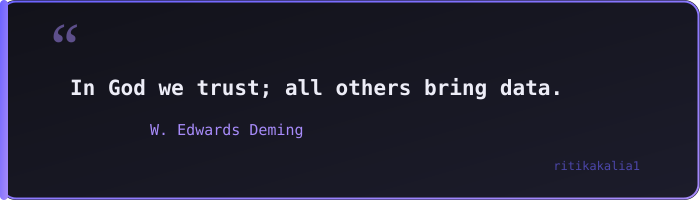

<!-- Top Wave -->

<!-- Shooting Star Header -->

<!-- Bottom Wave -->

  

---

---

---

<pre>
~ ❯ whoami

██████╗ ██╗████████╗██╗██╗  ██╗ █████╗     ██╗  ██╗ █████╗ ██╗     ██╗ █████╗
██╔══██╗██║╚══██╔══╝██║██║ ██╔╝██╔══██╗    ██║ ██╔╝██╔══██╗██║     ██║██╔══██╗
██████╔╝██║   ██║   ██║█████╔╝ ███████║    █████╔╝ ███████║██║     ██║███████║
██╔══██╗██║   ██║   ██║██╔═██╗ ██╔══██║    ██╔═██╗ ██╔══██║██║     ██║██╔══██║
██║  ██║██║   ██║   ██║██║  ██╗██║  ██║    ██║  ██╗██║  ██║███████╗██║██║  ██║
╚═╝  ╚═╝╚═╝   ╚═╝   ╚═╝╚═╝  ╚═╝╚═╝  ╚═╝    ╚═╝  ╚═╝╚═╝  ╚═╝╚══════╝╚═╝╚═╝  ╚═╝
</pre>

---

### 🔭 About Me

- 🎓 B.E. in Computer Science & Engineering @ Chandigarh College of Engineering & Technology — CGPA 9.45 (till 6th SEM)
- 🐍 Interested in Python, Flask, Django, Machine Learning, Deep Learning, and Neural Networks using PyTorch
- 🔭 Open to AI/ML Engineer / Full-Stack Developer roles

### 🚀 Tech Stack

`Python` `C` `SQL` `JavaScript` `HTML` `CSS` `Django` `Flask` `PyTorch` `Git` `Figma`

### 🏆 Honours & Awards

- **IEEE ICIR 2026, e-Poster Presentation** — "Real-Time Privacy Guardianship in XR Metaverses"; VR attack detection at 92% accuracy, University of Pisa, Italy
- **Publication:** "Memory in Conversational AI Agents: The Backbone of Long-Term Intelligence"
- **3rd Position, Business Blueprint 2025 (IIC), CCET** — Pitched "Women Safety Analytics System," a multimodal AI/ML surveillance solution

### 🧭 Positions of Responsibility
- **Chairperson** | ACM-W CCET Student Chapter (July 2025 – July 2026)
- **Technical Team Member** | CCET APRATIM 2025 (College Tech Fest)
- **Design Contributor** | CCET College Website Team — designed official departmental web pages (Figma)

 

### 💭

